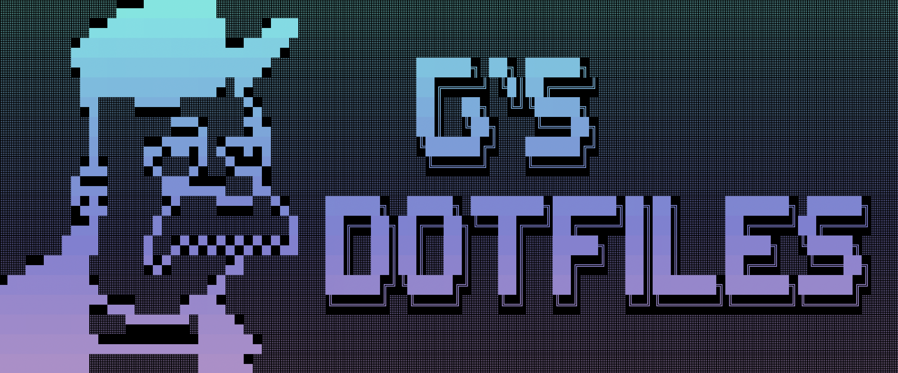

# G's-Dotfiles

My installation and configuration scripts for MacOS and Linux.



Heavily influenced by [Omakub](https://omakub.org/).

## What this be

This is a curated collection of app installation and configuration scripts for MacOS and Linux (coming soon). It is designed to provide a simple and aesthetic experience for users of all kinds, and to provide the best (opinionated) choices for any environment.  It is also designed to provide most of the [Omakub](https://omakub.org/) functionality, without the restrictions of requiring Ubuntu Gnome.  It contains many of my own personal touches, from App choices, to MacOS configurations, and more.

## How it do

1. Open your terminal
1. Run the following scipt: (coming soon)
1. Follow the prompts.
1. You're done!
1. Restart your machine just to be safe.

## Application highlights

1. Brave - the best privacy-oriented browser of late. Also includes Chrome and Firefox.  Yes Brave soupports Tor links, which is why I didn't include the Tor browser
1. Libreoffice - Free and open source office suite.
1. Alacritty - A fantastic terminal emulator replacement for whatever came with your OS.<br>
[Learn to use the terminal](https://a.co/d/bwIR32o)
1. Zellij - The session manager inside of Alacritty. Like tmux, but better. Think sessions, panes, tabs, etc.
1. Lazyvim - A curated Neovim with all the best plugins and configurations. A powerful text editor and IDE.<br>
  **Learn Lazyvim** with [this fantastic book](https://lazyvim-ambitious-devs.phillips.codes/).
1. Visual Studio Code - the other most popular IDE out there. For us filthy casuals who haven't learned Neovim yet. The main reasons to use this other than the plugins and language servers and built in terminal are the MULTIPLE CURSORS.
1. Obsidian - An incredibly powerful knowledge database. Organize information, take notes, manage projects, etc.  You can do A LOT with this, this is a very deep rabbit hole.
1. Signal - the best messenger ever. Open source and end-to-end encrypted.
1. Discord - You know what this is.
1. Element - an open source, privacy focused Discotd alternative. E2E encrypted and runs on the distrubted Matrix network.  Comes pre-baked with better E2E encryption than even Signal.
1. Alfred - A spotlight replacement that is easily the most powerful launcher out there.  I recommend paying for a full PowerPack license to unlock the amazing tools and automation this thing has.<br>
In particular, I cannot imagine life without its clipboard history manager.
1. Rectangle - The best MacOS window manager. Comes with great default keymaps and a wide assortment of window tiling options.
1. Spotify - you know what this is too.
1. Many of the hot new terminal apps. btop, zoxide, lazygit, lazydocker, etc.
1. Steam - it's for games.
1. Furnace - a free and open source chiptune music tracker. Supports nearly every game system and chipset out there.
1. Nerd fonts - Some of my favorites are included. These are for your terminal, IDE, and system fonts.  I configured everything to use `JetBrainsMono Nerd Font Mono` by default. Because it's the best one.

And much, much more! To see everything this is installing, open the various `Brewfile-*` files under the `install.d/[your os]` folder.

### You're using a launcher and Homebrew for apps now

**NOT ENOUGH OF YOU ARE USING LAUNCHERS!**

Set up Alfred (or Apple Spotlight if you wish), set the keyboard shortcut to `Command+Space`, and use that to launch your apps and do searches and other things.  It is a very powerful tool that gets you away from your mouse/trackpad. Use your keyboard, learn your keyboard shortcuts, use your terminal (see below), it will improve your life dramatically.

Pay for the Alfred PowerPack, set up the Clipboard History/Manager (my shortcut is `ctrl+option+command+v`), and wonder how you got this far in life without one. For you coders out there, this thing allows you to create you own custom tools and workflows just by connecting shell scripts together. You can combine python, bash, lua, whatever, and make your own launcher tools/automation by connecting them together.

Also, this is using [Homebrew](https://brew.sh/) to install all of these apps. You're using Homebrew for installing and updating apps now, so learn to use it. You do this in the terminal. See below.

### NOT ENOUGH OF YOU ARE USING THE TERMINAL

I get it, you are a squishy little baby and the command line scares you.  But the way forward to becoming NOT a squishy baby and a motorcyle riding killer assassin is to use the command line (Alacrtitty).  Pick up [this book](https://a.co/d/bwIR32o) to learn everything you need to know.  Just know that you aren't using `bash`, you are using `zsh`.

You'll also need to update and upgrade your apps using Homebrew:

```bash
brew update
brew upgrade
```

Figure out how to install your favorite apps by Google-ing "homebrew [my-app]".

## What is this configuring?

Great question, I love your diligence and enthusiasm. The configuration scripts are any file with an `.sh` extension under the `install.d/` folder, and `install.d/[your os]`. Everything in the script will be commented to tell you what it is doing. Review these files before running the `install.sh` script.

If you see something you don't want, DON'T DELETE IT! Insert a `#` in front of the line(s) you don't want to be run, and it will disable them. This allows you to control what the script is doing, but also keep the lines there just in case you change your mind later.

This is also using `stow` to symlink configuration dotfiles to your system. These files are located under `install.d/dotfiles`. Note that most of them are hidden, so you will need to use `ls -al` to see them in the terminal. In finder, use `Command + Shift + Period` to see them.
Don't mess around with these unless you know what you're doing, but feel free to take a look at what's there.

## What else is this doing?

Gosh, um:

1. Creating a list of handy folders under you `$HOME` directory. The list is found in the `install.d/directories.sh` script.
1. Changes your desktop wallpaper (optional) - I'm sure you like yours, but I think mine is better. In the future I'm going to include different wallpapers for different theme choices, but that is not ready yet. Right now you get my wallpaper and `Tokyo Night`, and you're going to LIKE IT.
1. Installs zsh and Oh-My-Zsh with plugins to make your shell experience real nice.

## TODO

1. Fix the `gum choose` bug preventing me from allowing selections in the app categories installation.
1. Add linux. Debian systems first, specifically Kubuntu and Kali (Gnome only), since that's what I'm rocking.
1. Add theme and font selection.
1. Fine tune programming language installation using `mise`.
1. Add support for selecting and installing databases via docker.
1. Expand devops tooling bigtime. Review recommended lists on youtube.
1. Add more artist/creative apps.
1. Add Arch support. I respect Arch, and they deserve the G's Dotfile/Omakub experience too. Never used it, probably going to be a huge pain, but we're going to deal with it and make it work.
1. Fine tune what apps I'm installing and plugins/configs I'm adding.  I'm brand new to neovim and not sure about some of my choices regarding [Mini.nvim](https://github.com/nvim-mini/mini.nvim)
1. Consider switching to `Nix` package manager. I hear great things, but I also hear nightmare things.  Homebrew has been good to me so I'm sticking with it for now. It might be worse on linux.

## License

G's Dotfiles is released under the [Apache 2.0](https://www.apache.org/licenses/LICENSE-2.0) license.
